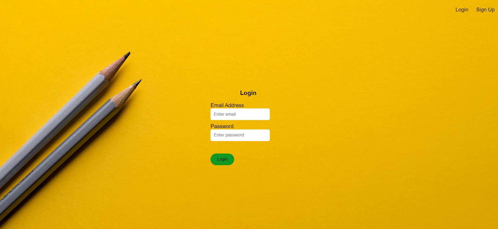
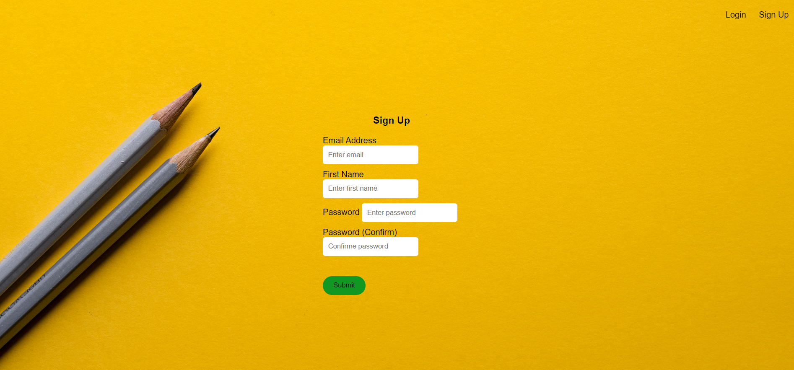
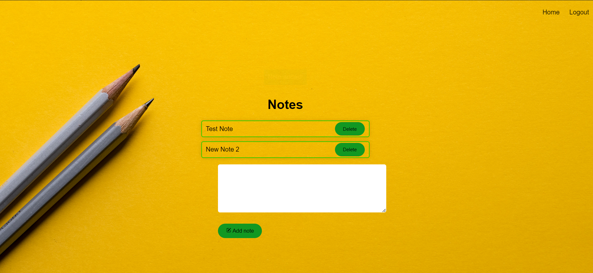

# Project Title

A web application for note-taking. Users can create, view, and delete notes.

## Description

This project is a web application built with Flask and uses HTML, CSS, and JavaScript for the frontend. It allows users to create an account, log in, and manage their notes. Each note can be created, viewed, and deleted. The application also includes features such as alerts and animations for a better user experience.

## Installation

1. Clone the repository:
    ```
    git clone https://github.com/yourusername/yourrepository.git
    ```
2. Install the required packages:
    ```
    pip install -r requirements.txt
    ```
3. Run the application:
    ```
    python app.py
    ```

## Usage

After logging in, users can create a new note by typing into the text box and clicking the "Add note" button. Existing notes are displayed in a list, with each note having a "Delete" button on the right side. Users can delete a note by clicking this button.

## Contributing

Pull requests are welcome. For major changes, please open an issue first to discuss what you would like to change.


## App looke like this:
### Login:


### Sign Up


### When Login:

